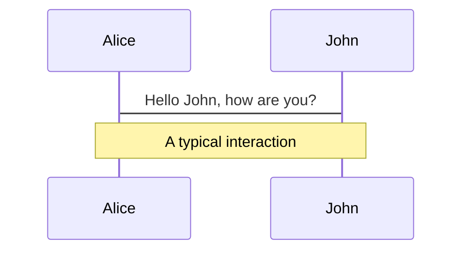
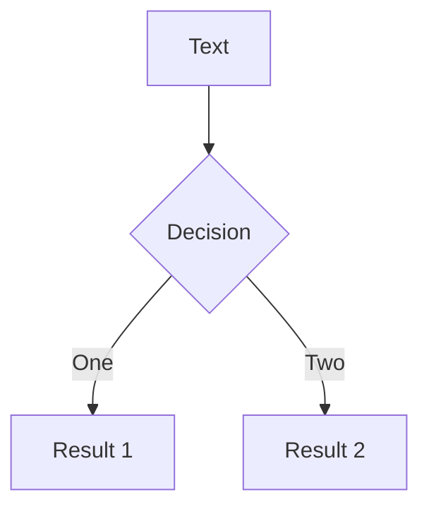
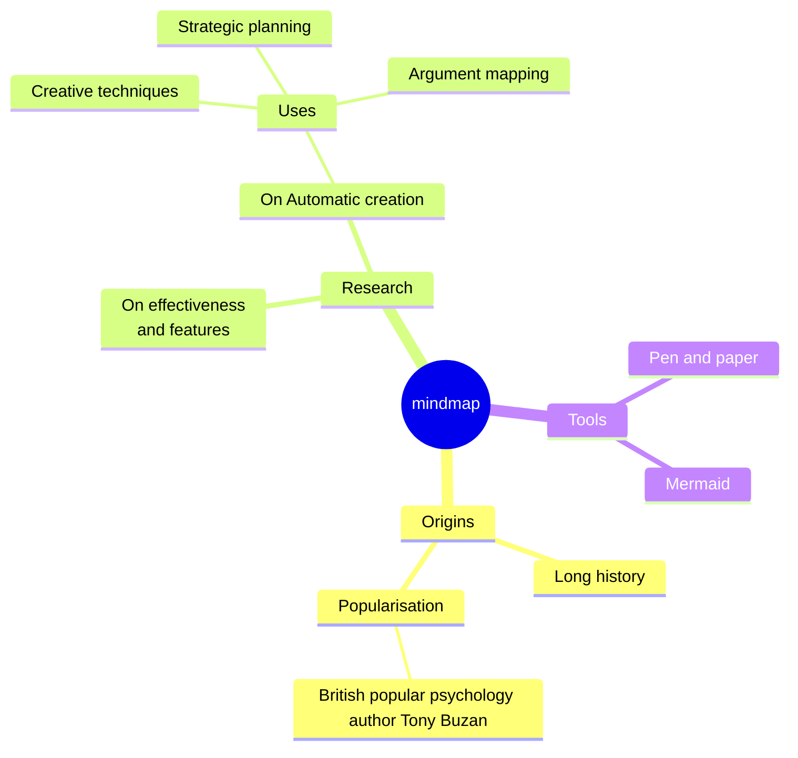
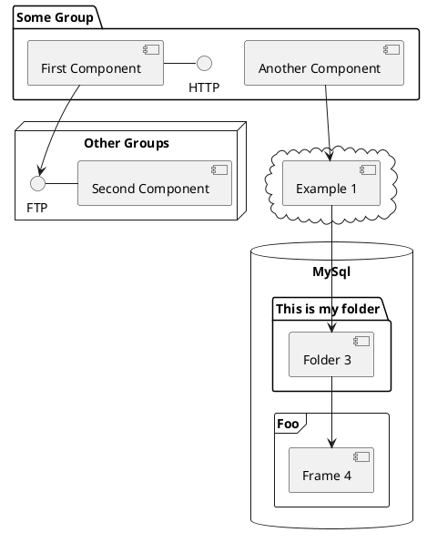

---
# You can also start simply with 'default'
theme: ../../personal/slidev-theme-rockdove
# random image from a curated Unsplash collection by Anthony
# like them? see https://unsplash.com/collections/94734566/slidev
# background: https://cover.sli.dev
# some information about your slides (markdown enabled)
title: Zeroing in on Number Storage
info: |
  We all know computers “work in binary”, but how does that affect our day-to-day coding? Understand binary basics, the point of floating-point, and dip into decimals and doubles. Learn why 1 + 1 = 10 and 0.1 + 0.2 ≠ 0.3.
# https://sli.dev/features/drawing
drawings:
  persist: false
# slide transition: https://sli.dev/guide/animations.html#slide-transitions
transition: fade .3s
# enable MDC Syntax: https://sli.dev/features/mdc
mdc: true
header: "Joe Glombek"

layout: center
class: text-center
---


<style>
  .slidev-layout {
    th em {
        opacity: 0.5;
        font-weight: normal;
        font-style: normal;
    }

    sub {
      opacity: 0.5;
    }
    
    .color-preview {
      border-radius: var(--slidev-code-radius);
      vertical-align: text-bottom;
      margin-right: calc(-1.5 * var(--slidev-code-radius));
      position: relative;
      height: calc(0.9em - 1px) !important;
      padding-top: 0.125rem;
    padding-bottom: 0.125rem;
    width: calc(0.9em + 2 * 0.125rem) !important;
    box-sizing: content-box;


    + code {
      padding-left: calc(1.5 * var(--slidev-code-radius) + 0.375rem) !important;
    }
    }
    
      tr {
    position: relative;
  }
  .truncate {
    position: absolute;
    display: block;
    height: 0.4rem;
    width: 100%;
    line-height: 0;
    overflow:visible;
    bottom: -0.3rem;
    left: 0;
    background-color: white;
    &:before {
      content: '…'
    }
  }
  }
</style>


| H    | T    | U    |
| ---- | ---- | ---- |
| 6    | 6    | 6    |

---
layout: center
class: text-center
---


| 100  | 10   | 1    |
| ---- | ---- | ---- |
| 6    | 6    | 6    |

---
layout: center
class: text-center
---


| 100  | 10   | 1    |
| ---- | ---- | ---- |
| 6    | 6    | 6    |
| 600  | 60   | 6    |

---
layout: center
class: text-center
---
| 10^2 *= 100* | 10^1 *= 10* | 10^0 *= 1* |
| --------------------------------- | -------------------------------- | ------------------------------- |
| 6                                 | 6                                | 6                               |

---
layout: center
class: text-center
---

## “Base 10”

**10**^1<br />⬆️

---
layout: default
---

## Some bassists you might've heard of


---
layout:
---

## Some [bases]{v-mark.underline.orange=0} you might've heard of

<v-clicks>

- [dec]{v-mark.highlight.orange=2}imal
  
  base 10 🤚✋
- [duodec]{v-mark.highlight.orange=3}imal or [dozen]{v-mark.highlight.orange=3}al
  
  base 12 🥚🥚🥚🥚🥚🥚
- [hexadec]{v-mark.highlight.orange=4}imal
  
  base 16 🎨
- [bi]{v-mark.highlight.orange=5}nary
  
  base 2 🚲💻

</v-clicks>

---
---
## Why do computers use binary?

Base 10 has 10 digits: 0, 1, 2, 3, 4, 5, 6, 7, 8, 9

Base 2 has 2 digits: 0, 1

Hey look, that's a bit!

On or off

---
layout: center
class: text-center
---

# Counting in decimal

&hellip;
<v-clicks>

| 10^2 *= 100* | 10^1 *= 10* | 10^0 *= 1* |
| ---------------------- | --------------------- | -------------------- |
|                        |                       | 1                    |
|                        |                       | 2[]{.truncate}       |
|                        |                       | 9                    |
|                        | 1                     | 0[]{.truncate}       |
|                        | 9                     | 9                    |
| 1                      | 0                     | 0                    |

</v-clicks>

---
layout: center
class: text-center
---

# Counting in binary

<v-clicks>

| 2^3 *= 4* | 2^1 *= 2* | 2^0 *= 1* |
| ---- | ---- | ---- |
|      |      | 1    |
|      | 1 | 0   |
|      | 1 | 1 |
| 1 | 0 | 0   |
| 1 | 0   | 1   |
| 1 | 1                              | 0                             |
| 1 | 1                              | 1                              |

</v-clicks>

---
layout: center
---

# Binary

What does `101010`_2 mean?

<v-clicks>

|  | 2^6 *= 32*| 2^5 *= 16*| 2^4 *= 8*| 2^3 *= 4* | 2^2 *= 2* | 2^1 *= 1* |
| -------------- | -------------- | -------------- | -------------- | -------------- | -------------- | -------------- |
| Binary    | 1          | 0          | 1          | 0          | 1          | 0                                    |
| Conversion | 1 &times; 32 | 0 &times; 16 | 1 &times; 8 | 0 &times; 4 | 1 &times; 2 | 0 &times; 1                          |
| Decimal | 32_10 | 0 | 8_10 | 0 | 2_10 | 0                                    |

</v-clicks>

---

32 + 8 + 2 = 

<SlidevVideo v-click autoplay>
  <source src="/media/42.mp4" type="video/mp4" />
</SlidevVideo>

---
layout: intro
class: invert
---

# Hexadecimal side-quest!
*(Yes, we still have time for side-quests in a 10 minute talk)*


---
layout: center
class: text-center
---

<v-clicks>

| 16^1 *= 16* | 16^0 *= 1* |
| ----------- | ---------- |
|             | 1          |
|             | 2[]{.truncate}          |
|             | 9          |
|             | A          |
|             | B          |
|             | C[]{.truncate}          |
|             | F          |
| 1           | 0          |

</v-clicks>

---
layout: two-cols-header
---

## Why use hexadecimal in computing?

1010_2 = 0 + 2 + 0 + 8 = 10_10

10101010_2 = 0 + 2 + 0 + 8 + 0 + 32 + 0 + 128 = 170_10

But in hexadecimal....

10_10 = A_16

170_10 = AA_16

So converting from binary to hexadecimal is easy!

[1 0 1 0]{v-mark.box.orange=1} [ 1 0 1 0]{v-mark.box.orange=2}&nbsp;_2

&nbsp;&nbsp;&nbsp;&nbsp;A&nbsp;&nbsp;&nbsp;&nbsp;&nbsp;&nbsp;&nbsp;&nbsp;A&nbsp;&nbsp;&nbsp;&nbsp;&nbsp;&nbsp;&nbsp;&nbsp;_16

1010_2 = A_16, so 10101010_2 must be AA_16.

---
layout: center
---

# Two hex characters are a byte!

| Red        | Green      | Blue       |
| ---------- | ---------- | ---------- |
| 239_10      | 131_10     | 84_10     |
| EF_16      | 83_16      | 54_16      |
| 11101111_2 | 10000011_2 | 01010100_2 |


Giving us the colour-code `#EF8354` (or `rgb(239, 131, 84)`)

<br />

*3 letter colour codes are cheating, and mean nothing.* <br />
*`#267` = `#226677` Nothing numerically pleasing at all 😔*

---
layout: intro
class: invert
---

/sidequest

---
layout: center
---

# Well, that's all well and good for **whole numbers**...

---
layout: center
---

## Counting fractional numbers in **decimal**

| 10^2 *= 100* | 10^1 *= 10* | 10^0 *= 1* | .    | **10^-1**{v-click} *= 1/10* | **10^-2**{v-click} *=  1/100* | **10^-3**{v-click} *= 1/1000* |
| ------------ | ----------- | ---------- | ---- | -------------- | --------------- | ---------------- |
| 0           | 0           | 3          | .    | 1             | 4              | 1                             |

<v-click>&pi; &approx; 3.141</v-click>

<v-click>

## Counting fractional numbers in binary

| 2^2 *= 4* | 2^1 *= 2* | 2^0 *= 1* | .    | 2^-1 *= 1/2* | 2^-2 *=  1/4* | 2^-3*= 1/8* |
| ------------ | ----------- | ---------- | ---- | -------------- | --------------- | ---------------- |
| 0          | 1         | 1          | .    | 0             | 0               | 1                |

</v-click>

<v-click>&pi; &approx; 3.125</v-click>

---
layout: center
---

## Recursion in decimal

In base 10, $\frac{1}{3}$ is a bit of a problem...

| 10^0 | .    | 10^-1 | **10^-2** | 10^-3 | 10^-4 | 10^-5 | 10^-6 | 10^-7 |
| ------------ | ----------- | ---------- | ---- | -------------- | --------------- | ---------------- | ---------------- | ---------------- |
| 0          | .          | 3          | 3    | 3             | 3              | 3                             | 3                            | 3                            |


$\frac{1}{3} = 0.\overline{3}_{10} \approx 0.3333333_{10}$

---
layout: center
---

## Recursion in binary
In base 2, $\frac{1}{3}$ is **still** problem... 

| 2^0 | .    | 2^-1 | 2^-2 | 2^-3 | 2^-4 | 2^-5 | 2^-6 | 2^-7 |
| ------------ | ----------- | ---------- | ---- | -------------- | --------------- | ---------------- | ---------------- | ---------------- |
| 0          | .          | 0          | 1    | 0             | 1             | 0                             | 1                            | 0                            |

$\frac{1}{3} = 0.\overline{10}_{2} \approx 0.0101010_{2} = 0.328125_{10}$

---
layout: center
---

But so is  $\frac{1}{10}$... 

| 2^0  | .    | 2^-1 | 2^-2 | 2^-3 | 2^-4 | 2^-5 | 2^-6 | 2^-7 |
| ---- | ---- | ---- | ---- | ---- | ---- | ---- | ---- | ---- |
| 0    | .    | 0    | 0    | 0    | 1    | 1    | 0    | 0    |

$\frac{1}{10} = 0.0\overline{0011}_{2} \approx 0.0001100_{2} = 0.09375_{10}$

---

$$
\begin{array}{c c c}
    & 0 & . & 1_{10} \\
  + & 0 & . & 2_{10} \\ \hline
    & 0 & . & 3_{10}
\end{array}
$$

$$
\begin{array}{c c c c c c c c c }
    & 0 & . & 0 & 0 & 0 & 1 & 1 & 0 & 0_{2} & \approx 0.1_{10}\\
  + & 0 & . & 0 & 0 & 1 & 1 & 0 & 0 & 1_{2} & \approx 0.2_{10} \\ \hline
    & 0 & . & 0 & 1 & 0 & 0 & 1 & 0 & 1_{10} & = 0.2890625_{10}
\end{array}
$$
---

```ts {monaco} {showOutputAt:'+1'}
console.log(0.1 + 0.2)
```


---
layout:
---
# Welcome to Slidev

Presentation slides for developers

<div @click="$slidev.nav.next" class="mt-12 py-1" hover:bg="white op-10">
  Press Space for next page <carbon:arrow-right />
</div>

<div class="abs-br m-6 text-xl">
  <button @click="$slidev.nav.openInEditor" title="Open in Editor" class="slidev-icon-btn">
    <carbon:edit />
  </button>
  <a href="https://github.com/slidevjs/slidev" target="_blank" class="slidev-icon-btn">
    <carbon:logo-github />
  </a>
</div>

<!--
The last comment block of each slide will be treated as slide notes. It will be visible and editable in Presenter Mode along with the slide. [Read more in the docs](https://sli.dev/guide/syntax.html#notes)
-->

---
transition: fade-out
---

# What is Slidev?

Slidev is a slides maker and presenter designed for developers, consist of the following features

- 📝 **Text-based** - focus on the content with Markdown, and then style them later
- 🎨 **Themable** - themes can be shared and re-used as npm packages
- 🧑‍💻 **Developer Friendly** - code highlighting, live coding with autocompletion
- 🤹 **Interactive** - embed Vue components to enhance your expressions
- 🎥 **Recording** - built-in recording and camera view
- 📤 **Portable** - export to PDF, PPTX, PNGs, or even a hostable SPA
- 🛠 **Hackable** - virtually anything that's possible on a webpage is possible in Slidev
<br>
<br>

Read more about [Why Slidev?](https://sli.dev/guide/why)

<!--
You can have `style` tag in markdown to override the style for the current page.
Learn more: https://sli.dev/features/slide-scope-style
-->

<style>
h1 {
  background-color: #2B90B6;
  background-image: linear-gradient(45deg, #4EC5D4 10%, #146b8c 20%);
  background-size: 100%;
  -webkit-background-clip: text;
  -moz-background-clip: text;
  -webkit-text-fill-color: transparent;
  -moz-text-fill-color: transparent;
}
</style>

<!--
Here is another comment.
-->

---
transition: slide-up
level: 2
---

# Navigation

Hover on the bottom-left corner to see the navigation's controls panel, [learn more](https://sli.dev/guide/ui#navigation-bar)

## Keyboard Shortcuts

|                                                     |                             |
| --------------------------------------------------- | --------------------------- |
| <kbd>right</kbd> / <kbd>space</kbd>                 | next animation or slide     |
| <kbd>left</kbd>  / <kbd>shift</kbd><kbd>space</kbd> | previous animation or slide |
| <kbd>up</kbd>                                       | previous slide              |
| <kbd>down</kbd>                                     | next slide                  |

<!-- https://sli.dev/guide/animations.html#click-animation -->

<p v-after class="absolute bottom-23 left-45 opacity-30 transform -rotate-10">Here!</p>

---
layout: two-cols
layoutClass: gap-16
---

# Table of contents

You can use the `Toc` component to generate a table of contents for your slides:

```html
<Toc minDepth="1" maxDepth="1" />
```

The title will be inferred from your slide content, or you can override it with `title` and `level` in your frontmatter.

::right::

<Toc text-sm minDepth="1" maxDepth="2" />

---
layout: image-right
image: https://cover.sli.dev
---

# Code

Use code snippets and get the highlighting directly, and even types hover!

```ts {all|5|7|7-8|10|all} twoslash
// TwoSlash enables TypeScript hover information
// and errors in markdown code blocks
// More at https://shiki.style/packages/twoslash

import { computed, ref } from 'vue'

const count = ref(0)
const doubled = computed(() => count.value * 2)

doubled.value = 2
```

<arrow v-click="[4, 5]" x1="350" y1="310" x2="195" y2="334" color="#953" width="2" arrowSize="1" />


<!-- Footer -->

[Learn more](https://sli.dev/features/line-highlighting)

<!-- Inline style -->
<style>
.footnotes-sep {
  @apply mt-5 opacity-10;
}
.footnotes {
  @apply text-sm opacity-75;
}
.footnote-backref {
  display: none;
}
</style>

<!--
Notes can also sync with clicks

[click] This will be highlighted after the first click

[click] Highlighted with `count = ref(0)`

[click:3] Last click (skip two clicks)
-->

---
level: 2
---

# Shiki Magic Move

Powered by [shiki-magic-move](https://shiki-magic-move.netlify.app/), Slidev supports animations across multiple code snippets.

Add multiple code blocks and wrap them with <code>````md magic-move</code> (four backticks) to enable the magic move. For example:

````md magic-move {lines: true}
```ts {*|2|*}
// step 1
const author = reactive({
  name: 'John Doe',
  books: [
    'Vue 2 - Advanced Guide',
    'Vue 3 - Basic Guide',
    'Vue 4 - The Mystery'
  ]
})
```

```ts {*|1-2|3-4|3-4,8}
// step 2
export default {
  data() {
    return {
      author: {
        name: 'John Doe',
        books: [
          'Vue 2 - Advanced Guide',
          'Vue 3 - Basic Guide',
          'Vue 4 - The Mystery'
        ]
      }
    }
  }
}
```

```ts
// step 3
export default {
  data: () => ({
    author: {
      name: 'John Doe',
      books: [
        'Vue 2 - Advanced Guide',
        'Vue 3 - Basic Guide',
        'Vue 4 - The Mystery'
      ]
    }
  })
}
```

Non-code blocks are ignored.

```vue
<!-- step 4 -->
<script setup>
const author = {
  name: 'John Doe',
  books: [
    'Vue 2 - Advanced Guide',
    'Vue 3 - Basic Guide',
    'Vue 4 - The Mystery'
  ]
}
</script>
```
````

---

# Components

<div grid="~ cols-2 gap-4">
<div>

You can use Vue components directly inside your slides.

We have provided a few built-in components like `<Tweet/>` and `<Youtube/>` that you can use directly. And adding your custom components is also super easy.

```html
<Counter :count="10" />
```

<!-- ./components/Counter.vue -->
<Counter :count="10" m="t-4" />

Check out [the guides](https://sli.dev/builtin/components.html) for more.

</div>
<div>

```html
<Tweet id="1390115482657726468" />
```

<Tweet id="1390115482657726468" scale="0.65" />

</div>
</div>

<!--
Presenter note with **bold**, *italic*, and ~~striked~~ text.

Also, HTML elements are valid:
<div class="flex w-full">
  <span style="flex-grow: 1;">Left content</span>
  <span>Right content</span>
</div>
-->

---
class: px-20
---

# Themes

Slidev comes with powerful theming support. Themes can provide styles, layouts, components, or even configurations for tools. Switching between themes by just **one edit** in your frontmatter:

<div grid="~ cols-2 gap-2" m="t-2">

```yaml
---
theme: default
---
```

```yaml
---
theme: seriph
---
```


</div>

Read more about [How to use a theme](https://sli.dev/guide/theme-addon#use-theme) and
check out the [Awesome Themes Gallery](https://sli.dev/resources/theme-gallery).

---

# Clicks Animations

You can add `v-click` to elements to add a click animation.

<div v-click>

This shows up when you click the slide:

```html
<div v-click>This shows up when you click the slide.</div>
```

</div>

<br>

<v-click>

The <span v-mark.red="3"><code>v-mark</code> directive</span>
also allows you to add
<span v-mark.circle.orange="4">inline marks</span>
, powered by [Rough Notation](https://roughnotation.com/):

```html
<span v-mark.underline.orange>inline markers</span>
```

</v-click>

<div mt-20 v-click>

[Learn more](https://sli.dev/guide/animations#click-animation)

</div>

---

# Motions

Motion animations are powered by [@vueuse/motion](https://motion.vueuse.org/), triggered by `v-motion` directive.

```html
<div
  v-motion
  :initial="{ x: -80 }"
  :enter="{ x: 0 }"
  :click-3="{ x: 80 }"
  :leave="{ x: 1000 }"
>
  Slidev
</div>
```

<div class="w-60 relative">
  <div class="relative w-40 h-40">
    
    
    
  </div>

  <div
    class="text-5xl absolute top-14 left-40 text-[#2B90B6] -z-1"
    v-motion
    :initial="{ x: -80, opacity: 0}"
    :enter="{ x: 0, opacity: 1, transition: { delay: 2000, duration: 1000 } }">
    Slidev
  </div>
</div>

<!-- vue script setup scripts can be directly used in markdown, and will only affects current page -->
<script setup lang="ts">
const final = {
  x: 0,
  y: 0,
  rotate: 0,
  scale: 1,
  transition: {
    type: 'spring',
    damping: 10,
    stiffness: 20,
    mass: 2
  }
}
</script>

<div
  v-motion
  :initial="{ x:35, y: 30, opacity: 0}"
  :enter="{ y: 0, opacity: 1, transition: { delay: 3500 } }">

[Learn more](https://sli.dev/guide/animations.html#motion)

</div>

---

# LaTeX

LaTeX is supported out-of-box. Powered by [KaTeX](https://katex.org/).

<div h-3 />

Inline $\sqrt{3x-1}+(1+x)^2$

Block
$$ {1|3|all}
\begin{aligned}
\nabla \cdot \vec{E} &= \frac{\rho}{\varepsilon_0} \\
\nabla \cdot \vec{B} &= 0 \\
\nabla \times \vec{E} &= -\frac{\partial\vec{B}}{\partial t} \\
\nabla \times \vec{B} &= \mu_0\vec{J} + \mu_0\varepsilon_0\frac{\partial\vec{E}}{\partial t}
\end{aligned}
$$

[Learn more](https://sli.dev/features/latex)

---

# Diagrams

You can create diagrams / graphs from textual descriptions, directly in your Markdown.

<div class="grid grid-cols-4 gap-5 pt-4 -mb-6">









</div>

Learn more: [Mermaid Diagrams](https://sli.dev/features/mermaid) and [PlantUML Diagrams](https://sli.dev/features/plantuml)

---
foo: bar
dragPos:
  square: 559,27,167,_,-16
---

# Draggable Elements

Double-click on the draggable elements to edit their positions.

<br>

###### Directive Usage

```md

```

<br>

###### Component Usage

```md
<v-drag text-3xl>
  <div class="i-carbon:arrow-up" />
  Use the `v-drag` component to have a draggable container!
</v-drag>
```

<v-drag pos="279,429,261,_,-15">
  <div text-center text-3xl border border-main rounded>
    Double-click me!
  </div>
</v-drag>


###### Draggable Arrow

```md
<v-drag-arrow two-way />
```

<v-drag-arrow pos="54,437,433,-238" two-way op70 />

---

# Monaco Editor

Slidev provides built-in Monaco Editor support.

Add `{monaco}` to the code block to turn it into an editor:

```ts {monaco}
import { ref } from 'vue'
import { emptyArray } from './external'

const arr = ref(emptyArray(10))
```

Use `{monaco-run}` to create an editor that can execute the code directly in the slide:

```ts {monaco-run}
import { version } from 'vue'
import { emptyArray, sayHello } from './external'

sayHello()
console.log(`vue ${version}`)
console.log(emptyArray<number>(10).reduce(fib => [...fib, fib.at(-1)! + fib.at(-2)!], [1, 1]))
```

---
layout: center
class: text-center
---

# Learn More

[Documentation](https://sli.dev) · [GitHub](https://github.com/slidevjs/slidev) · [Showcases](https://sli.dev/resources/showcases)

<PoweredBySlidev mt-10 />
